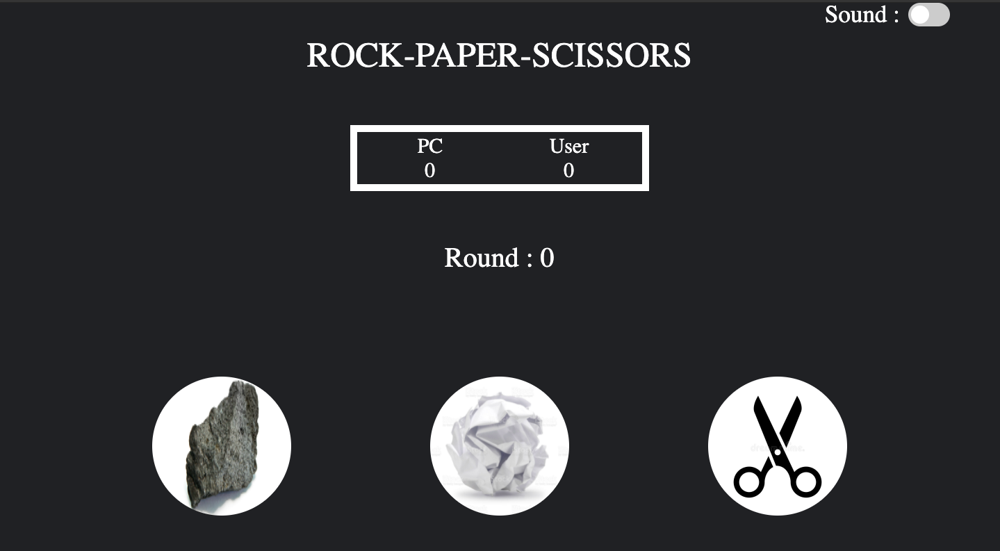

# Project: Rock Paper Scissors
Simple implementation of Rock Paper Scissors game.
This is my first **HTML/CSS/JS** project. **Live version** of the game is available [here](https://avasthiabhyudaya.github.io/rock-paper-scissors/).
### First stage | Game in the browser console
**The benefits I got from this stage:**
* Deepened knowledge of how **functions work** with each other.
* Learned how to color the **console text**.
* Enjoyed stylizing the **prompt** and **console texts**.

### Second stage | Game with added UI
**The benefits I got from this stage:**
* Learned to use and modify **[Font Awesome Icons](https://fontawesome.com/)**.
* Deepened knowledge of **CSS transform** and **transition** effects.
* Learned basic **manipulations of elements styles** through JavaScript code (setting attributes, adding/removing classes, changing inline styles and texts).
* Improved my **understanding of JavaScript functions** (organization, workspaces, scopes, calling, invoking, breaking down into smaller ones..).
* Learned how to create and use Slider buttons.
* Learned how to use sound and enable and disable it using the slider button.

### Summary
* The game has a **responsive layout**.
* The game is **fully playable** in the browser window.
* I really tried to keep **readable and understandable code**, **short functions**, **descriptive names** and tried to add a smooth feel to the game.

